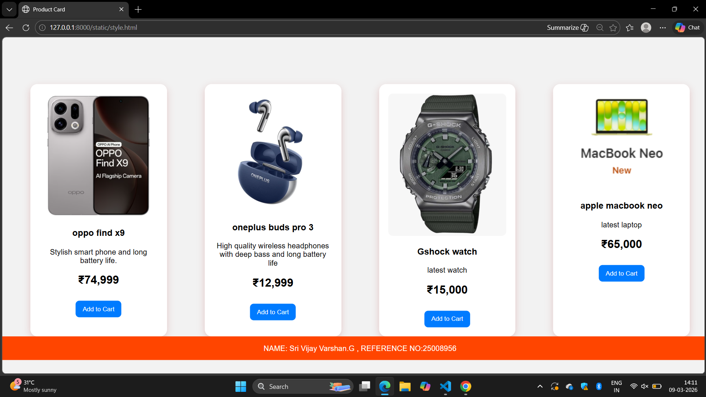

# Product Card Design with Hover Effect using CSS
## Date:09-03-2026

## AIM:
To design a Product Card for an E-commerce website using HTML and CSS and apply hover effects, transitions, and styling techniques to create an interactive user interface.

## DESIGN STEPS:

### Step 1:
Create a basic HTML structure using ```<!DOCTYPE html>, <html>, <head>, and <body>```.

### Step 2:
Add a container div for the product card.

### Step 3:
Insert the product image using the `````` tag.

### Step 4:
Add product name, description, and price using ```<h3>``` and ```<p>``` tags.

### Step 5:
Create an Add to Cart button using the ```<button>``` tag.

### Step 6:
Style the product card using CSS by applying:
<ul>
  <li>width</li>
  <li>padding</li>
  <li>border-radius</li>
  <li>box-shadow</li>
</ul>

### Step 7:
Align the card content using text-align and spacing properties.

### Step 8:
Add hover effects using :hover selector.

### Step 9:
Apply transform: translateY() to move the card slightly upward on hover.

### Step 10:
Increase the box-shadow to create a lifting effect.

### Step 11:
Add transform: scale() to slightly zoom the product image on hover.

### Step 12:
Apply transition property to make the hover animation smooth.

### Step 13:
Create a footer section at the bottom of the page.

### Step 14:
Display Learner Name and Register Number inside the footer.

### Step 15:
Style the footer using background color and center alignment.

### Step 10:
Test your webpage in a browser.

## PROGRAM:
```
style.html

<!DOCTYPE html>
<html>
<head>
    <meta charset="UTF-8">
    <title>Product Card</title>
    <link rel="stylesheet" href="style.css">
</head>

<body>

<div class="container">

    <div class="card">
        
        <h3>oppo find x9</h3>
        <p>Stylish smart phone and long battery life.</p>
        <h2>₹74,999</h2>
        <button>Add to Cart</button>
    </div>

    <div class="card">
        
        <h3>oneplus buds pro 3</h3>
        <p>High quality wireless headphones with deep bass and long battery life</p>
        <h2>₹12,999</h2>
        <button>Add to Cart</button>
    </div>
    
    <div class="card">
        
        <h3>Gshock watch</h3>
        <p>latest watch</p>
        <h2>₹15,000</h2>
        <button>Add to Cart</button>
    </div>

    <div class="card">
        
        <h3>apple macbook neo</h3>
        <p>latest laptop</p>
        <h2>₹65,000</h2>
        <button>Add to Cart</button>
    </div>

</div>

<footer>
    <p>NAME: Sri Vijay Varshan.G , REFERENCE NO:25008956</p>
</footer>

</body>
</html>

style.css

body{
    font-family: Arial;
    background-color:#f2f2f2;
    margin:0;
    padding:0;
}

.container{
    display:flex;
    justify-content:center;
    margin-top:100px;
    gap: 80px;
}

.card{
    width:250px;
    background:white;
    padding:20px;
    border-radius:15px;
    text-align:center;
    box-shadow:0 5px 15px rgba(164, 26, 26, 0.2);
    transition:0.5s;
}

.card img{
    width:100%;
    border-radius:10px;
    transition:0.5s;
}

.card:hover{
    transform:translateY(-10px);
    box-shadow:0 10px 25px orangered;
}

.card:hover img{
    transform:scale(1.05);
}

button{
    background:#007bff;
    color:white;
    border:none;
    padding:10px 15px;
    border-radius:8px;
    cursor:pointer;
    margin-top:10px;
}

button:hover{
    background:cyan;
}

footer{
    background-color:orangered;
    color:white;
    padding:0;
    text-align:center;
    position:absolute;
    bottom:O;
    width:100%;
}


```
## OUTPUT:

## RESULT:
The Product Card with Hover Effect was successfully designed using HTML and CSS.
